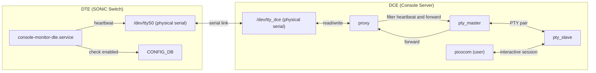
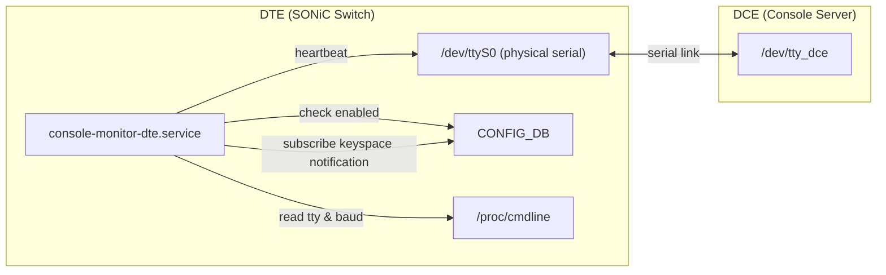
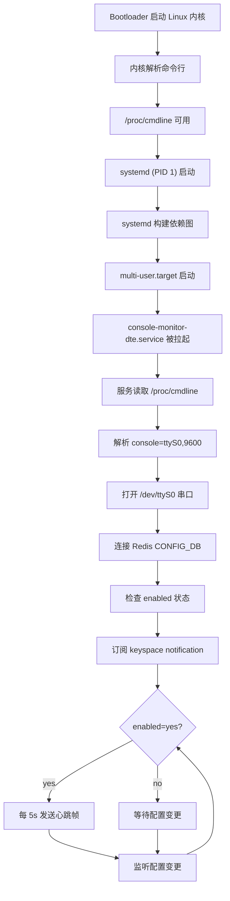

# SONiC Console Monitor

## High Level Design Document

### Revision

|  Rev  |   Date      |   Author   | Change Description |
| :---: | :---------: | :--------: | ------------------ |
|  0.1  | 12 Jan 2026 | Cliff Chen | Initial version    |

---

## 目录

- [术语与缩写](#术语与缩写)
- [1. 功能概述](#1-功能概述)
  - [1.1 功能需求](#11-功能需求)
- [2. 设计概述](#2-设计概述)
  - [2.1 架构](#21-架构)
  - [2.2 DTE 侧](#22-dte-侧)
  - [2.3 DCE 侧](#23-dce-侧)
- [3. 详细设计](#3-详细设计)
  - [3.1 帧结构设计](#31-帧结构设计)
  - [3.2 DTE 侧服务](#32-dte-侧服务)
  - [3.3 DCE 侧服务](#33-dce-侧服务)
- [4. 数据库更改](#4-数据库更改)
- [5. CLI](#5-cli)
- [6. 流程图](#6-流程图)
- [7. 参考资料](#7-参考资料)

---

## 术语与缩写

| 术语 | 定义 |
|------|------|
| DCE | Data Communications Equipment - Console Server 侧 |
| DTE | Data Terminal Equipment - SONiC Switch（被管理设备）侧 |
| Heartbeat | 用于验证链路连通性的周期性信号 |
| Oper | 运行状态（Up/Down） |
| PTY | Pseudo Terminal - 虚拟终端接口 |
| Proxy | 处理串口通信的中间代理进程 |
| TTY | Teletypewriter - 终端设备接口 |

---

## 1. 功能概述

在数据中心网络中，Console Server（DCE）通过串口直连多台 SONiC Switch（DTE），用于故障时的带外管理与控制台接入。控制台链路作为设备紧急救火场景中的最后一道防线，若链路故障未能及时发现，将大幅增加故障排查难度和时间成本。consoled 服务通过提供链路 Oper 状态的实时自动探测功能,为串口连接赋予可观测性,使运维团队能够即时监控链路健康状态。在故障处理时提供关键支撑,提升救火效率,缩短业务中断时间。


### 1.1 功能需求

*   **连通性检测**
    *   判断 DCE ↔ DTE 串口链路是否可用（Oper Up/Down）
*   **非侵入式（Non-Interference）**
    *   不影响正常 Console 运维，包括远程设备冷重启和系统重装
*   **健壮性**
    *   设备重启后可自动恢复探测

---

## 2. 设计概述

### 2.1 架构



### 关键决策

*   DCE侧无法确定DTE设备的初始状态（rebooting or normal），因此DCE无法主动向DTE发送探测数据，否则可能干扰bootloader

### 2.2 DTE 侧

DTE 侧通过 Redis keyspace notification 动态响应配置变化。在功能enabled的状态下，定期发送心跳帧以验证链路连通性。

*   **直接串口访问**
    *   服务直接打开物理串口（如 `/dev/ttyS0`）用于发送心跳
*   **心跳机制**
    *   启动时检查 CONFIG_DB 中 `CONSOLE_SWITCH|controlled_device` 的 `enabled` 字段
    *   监听 Redis keyspace notification，动态响应 enabled 状态变化
    *   仅在 enabled=yes 时每 5 秒发送心跳帧
    *   DTE → DCE 单向发送，保证 DTE 重启阶段不会收到干扰数据
*   **碰撞风险**
    *   正常数据流中可能包含心跳帧格式的数据，导致误判
    *   通过心跳帧设计降低碰撞概率

### 2.3 DCE 侧

在物理串口和用户应用之间创建 Proxy，负责心跳帧检测、过滤和链路状态维护。

*   **独占权**
    *   唯一持有物理串口文件描述符（`/dev/ttyUSBx`）的进程
*   **PTY 创建**
    *   为上层应用创建伪终端对
*   **PTY 符号链接**
    *   创建固定符号链接（如 `/dev/VC0-1`）指向动态 PTY slave（如 `/dev/pts/3`）
    *   上层应用（consutil、picocom）使用稳定的设备路径
*   **心跳过滤**
    *   识别心跳帧，更新状态，并丢弃心跳数据
*   **数据透传**
    *   非心跳数据透明转发到虚拟串口

---

## 3. 详细设计

### 3.1 帧结构设计

#### 3.1.1 帧格式

```
+----------+--------+-----+------+------+--------+---------+-------+----------+
| SOF x 3  | Version| Seq | Flag | Type | Length | Payload | CRC16 | EOF x 3  |
+----------+--------+-----+------+------+--------+---------+-------+----------+
|    3B    |   1B   | 1B  |  1B  |  1B  |   1B   |   N B   |  2B   |    3B    |
+----------+--------+-----+------+------+--------+---------+-------+----------+
```

| 字段 | 大小 | 描述 |
|------|------|------|
| SOF x 3 | 3 字节 | 帧头同步序列，0x05 0x05 0x05 |
| Version | 1 字节 | 协议版本，当前为 0x01 |
| Seq | 1 字节 | 序列号，0x00-0xFF 循环递增 |
| Flag | 1 字节 | 标志位，保留字段，当前为 0x00 |
| Type | 1 字节 | 帧类型 |
| Length | 1 字节 | Payload 长度 (值 <= 24) |
| Payload | N 字节 | 可选数据载荷 |
| CRC16 | 2 字节 | 校验和，大端序（高字节在前） |
| EOF x 3 | 3 字节 | 帧尾同步序列，0x00 0x00 0x00 |

**帧长度限制：**

*   **最大帧长度**
    *   去掉帧头帧尾后，不超过 64 字节
    *   Length的值 <= 24
    *   帧长度 <= buffer 长度确保从帧中间开始读取时能恢复对齐
*   **Buffer 大小**
    *   64 字节，可根据需求调整

**CRC16 计算：**

*   **算法**
    *   CRC-16/MODBUS
*   **计算范围**
    *   从 Version 到 Payload（不包含转义字符，使用原始数据）
    *   不包括帧头、CRC16 本身、帧尾
*   **字节序**
    *   大端序（高字节在前，低字节在后）

#### 3.1.2 帧类型定义

| Type | 值 (Hex) | 描述 |
|------|----------|------|
| HEARTBEAT | 0x01 | 心跳帧 |
| 保留 | 0x02-0xFF | 未来扩展 |

#### FLAG字段定义

标志位保留，当前默认为0x00

#### 3.1.3 心跳帧示例
```
05 05 05 01 00 00 01 00 XX XX 00 00 00
└──┬──┘ │  │  │  │  │  └──┬─┘ └──┬──┘
   │    │  │  │  │  │     │      └── EOF x 3 (帧尾同步序列)
   │    │  │  │  │  │     └── CRC16 (计算值)
   │    │  │  │  │  └──────── Length: 0 (无 payload)
   │    │  │  │  └─────────── Type: HEARTBEAT (0x01)
   │    │  │  └────────────── Flag: 0x00
   │    │  └───────────────── Seq: 0x00 (序列号)
   │    └──────────────────── Version: 0x01
   └───────────────────────── SOF x 3 (帧头同步序列)
```

#### 3.1.4 设计决策

*   **可靠检测**
    *   使用SOF，EOF，支持从帧中间开始读取时恢复对齐
    *   使用特殊控制字符作为帧定界符，限制帧的最大长度，引入sliding buffer，以支持从任意字节流中区分心跳帧
*   **容错性**
    *   为了避免单个字节的 bit error 不会导致帧同步丢失，使用 3 个重复的帧定界符作为同步序列
*   **透明传输**
    *   转义机制确保帧内容可使用任意字节

#### 3.1.5 关键假设

*   用户数据流中不会出现特殊字符，0x05 (SOF), 0x00 (EOF), 0x10 (DLE)
*   bit error 连续在 3 个字节中出现的概率可忽略不计

#### 3.1.6 特殊字符定义

| 字符 | 值 (Hex) | 名称 | 描述 |
|------|----------|------|------|
| SOF | 0x05 | Start of Frame | 帧起始字符 |
| EOF | 0x00 | End of Frame | 帧结束字符 |
| DLE | 0x10 | Data Link Escape | 转义字符 |

**定界符 ASCII 定义：**

*   **SOF (0x05)**
    *   ASCII ENQ (Enquiry)
    *   不可打印控制字符，现代终端和 shell 不解释此字符
    *   历史上用于轮询通信（主站询问从站是否就绪），现代系统已不使用
*   **EOF (0x00)**
    *   ASCII NUL (Null)
    *   空字符，终端通常直接忽略
    *   C 语言字符串终止符，不会出现在正常文本输出中
*   **DLE (0x10)**
    *   ASCII DLE (Data Link Escape)
    *   不可打印控制字符，专为数据链路层转义设计
    *   符合其历史语义，用于标记后续字符需要特殊处理

**同步序列设计：**

*   **帧头同步序列**
    *   3 个连续的 SOF 字符：0x05 0x05 0x05
    *   收到任何一个SOF都会起到状态转换的作用，而不是收到连续的三个SOF才会触发状态转换
    *   单个 SOF 发生 bit error 不会导致帧同步丢失
*   **帧尾同步序列**
    *   3 个连续的 EOF 字符：0x00 0x00 0x00
    *   同样，收到任何一个EOF字符都会触发状态转换
    *   同样提供 bit error 容错能力

#### 3.1.7 转义规则

当帧内容（帧头和帧尾之间）包含特殊字符时，需要进行转义：

| 原始字节 | 转义后 |
|----------|--------|
| 0x05 (SOF) | 0x10 0x05 |
| 0x00 (EOF) | 0x10 0x00 |
| 0x10 (DLE) | 0x10 0x10 |

**转义处理说明：**

*   **发送端**
    *   构造原始帧内容（Version + Seq + Flag + Type + Length + Payload）
    *   计算 CRC16（基于原始未转义数据）
    *   对整个帧内容（包括 CRC16）进行转义
    *   最后添加帧头和帧尾
*   **接收端**
    *   去除帧头和帧尾后，剩下的原始数据（包括转义字符）存入帧 buffer 中
    *   先对 buffer 进行去转义
    *   然后进行 CRC16 校验
    *   校验通过后提取各字段数据

#### 3.1.8 帧检测与过滤

**Buffer 设计：**

由于帧可能在被read时被拆分，需要引入一个 sliding buffer 来存储接收到的字节流以进行帧检测。

*   **特点：**
    *   固定大小 64 字节
    *   存储除了SOF，EOF以外的所有输入数据

**检测算法：**

```txt
PROCEDURE PROCESS(F, data)
    // F is a frame-filter object with fields:
    //   F.buffer        : sequence of bytes
    //   F.in_frame      : boolean
    //   F.escape_next   : boolean
    // And helper procedures:
    //   FLUSH_AS_USER_DATA(F)
    //   DISCARD_BUFFER(F)
    //   TRY_PARSE_FRAME(F)
    //   FLUSH_BUFFER(F)

    FOR each byte b in data DO
        IF F.escape_next = TRUE THEN
            // previous byte was DLE; treat b as normal data
            APPEND(F.buffer, b)
            F.escape_next ← FALSE

            IF LENGTH(F.buffer) ≥ MAX_FRAME_BUFFER_SIZE THEN
                FLUSH_BUFFER(F)
            END IF

        ELSE IF b = DLE THEN
            // mark next byte as escaped (but keep DLE in buffer)
            APPEND(F.buffer, b)
            F.escape_next ← TRUE

        ELSE IF b = SOF THEN
            IF F.in_frame = FALSE THEN
                // bytes before SOF are user data
                FLUSH_AS_USER_DATA(F)
            ELSE
                // SOF inside a frame => previous frame incomplete; discard
                DISCARD_BUFFER(F)
            END IF
            F.in_frame ← TRUE

        ELSE IF b = EOF THEN
            TRY_PARSE_FRAME(F)
            F.in_frame ← FALSE

        ELSE
            APPEND(F.buffer, b)

            IF LENGTH(F.buffer) ≥ MAX_FRAME_BUFFER_SIZE THEN
                FLUSH_BUFFER(F)
            END IF
        END IF
    END FOR
END PROCEDURE

```

**超时处理**

当超时时间内没有新数据时，根据`in_frame`状态，将缓冲区作为用户数据发送或丢弃
*   超时时间根据波特率动态计算：`timeout = (10 / baud) × MAX_FRAME_BUFFER_SIZE × 3`
*   公式说明：每字符时间（10 bits / 波特率）× 最大帧长度 × 3倍余量
*   如果不在帧内：将缓冲区作为用户数据发送
*   如果在帧内：帧不完整，丢弃缓冲区内容
*   退出帧内状态

---

### 3.2 DTE 侧服务

#### 3.2.1 服务: `console-monitor-dte.service`

DTE 侧服务实现心跳发送功能，通过 Redis keyspace notification 动态响应配置变化。

*   **参数获取**
    *   服务启动时直接读取 `/proc/cmdline`
    *   解析 `console=<TTYNAME>,<BAUD>` 参数获取 TTY 名称和波特率
    *   如果未指定波特率，默认使用 9600
*   **启动流程**
    1.  读取 `/proc/cmdline` 解析串口配置
    2.  打开物理串口（如 `/dev/ttyS0`）
    3.  连接 Redis CONFIG_DB
    4.  检查 `CONSOLE_SWITCH|controlled_device` 的 `enabled` 字段
    5.  订阅 Redis keyspace notification 监听配置变化
*   **心跳机制**
    *   监听 CONFIG_DB 中 `CONSOLE_SWITCH|controlled_device` 的 `enabled` 字段
    *   如果为 `"yes"`，每 5 秒发送心跳帧到串口
    *   如果不为 `"yes"`，停止发送心跳
    *   通过 keyspace notification 实时响应配置变更

#### 3.2.2 架构图



#### 3.2.3 服务启动与管理

DTE 侧服务使用 systemd 管理，服务启动时从内核命令行读取串口配置。

1.  **服务启动**
    *   `console-monitor-dte.service` 在 `multi-user.target` 后启动
    *   服务读取 `/proc/cmdline` 解析 `console=<TTYNAME>,<BAUD>` 参数
    *   打开对应串口并连接 Redis
    *   开始监听配置变化



---

### 3.3 DCE 侧 Console Monitor DCE 服务

#### 3.3.1 服务: `console-monitor-dce.service`

拓扑：


每条链路有独立的 Proxy 实例，负责串口读写与状态维护。

#### 3.3.2 超时判定

超时周期默认 15 秒。如果在此期间未收到心跳，触发超时时间。

#### 3.3.3 Oper 状态判定

每条链路维护独立状态，采用心跳与数据活动双重检测机制：

*   **状态变为 UP**：收到心跳帧时，Proxy 重置心跳超时定时器并将 oper 状态设为 UP
*   **状态变为 DOWN**：心跳超时（默认 15 秒）触发时，额外检查最近是否有串口数据活动：
    *   如果在超时周期内有数据活动（即使没有心跳），重置定时器继续等待
    *   如果既没有心跳也没有数据活动，oper 状态设为 DOWN
*   **设计原因**：避免因 DTE 侧繁忙导致心跳写入阻塞时误判链路状态

状态变更写入 STATE_DB。

STATE_DB 条目：

*   Key: `CONSOLE_PORT|<link_id>`
*   Field: `oper_state`, Value: `up` / `down`
*   Field: `last_state_change`, Value: `<timestamp>`（状态变化时间戳）

#### 3.3.4 服务启动与初始化

console-monitor-dce 服务按以下顺序启动：

1.  **等待依赖**
    *   在 `config-setup.service` 完成将 config.json 加载到 CONFIG_DB 后启动
2.  **连接 Redis**
    *   建立到 CONFIG_DB 和 STATE_DB 的连接
3.  **读取 PTY 符号链接前缀**
    *   从 `<platform_path>/udevprefix.conf` 读取设备前缀（如 `C0-`）
    *   构造虚拟设备前缀 `/dev/V<prefix>`（如 `/dev/VC0-`）
4.  **初始同步（检查 Console 功能）**
    *   检查 CONFIG_DB 中 `CONSOLE_SWITCH|console_mgmt` 的 `enabled` 字段
    *   如果 `enabled` 不为 `"yes"`，跳过 Proxy 初始化，服务继续运行但不启动任何 Proxy
    *   如果 `enabled` 为 `"yes"`，为 CONFIG_DB 中的每个串口配置初始化 Proxy 实例
5.  **订阅配置变更**
    *   同时监听以下 CONFIG_DB keyspace 事件：
        *   `CONSOLE_PORT|*` - 串口配置变更
        *   `CONSOLE_SWITCH|*` - Console 功能开关变更
6.  **初始化 Proxy 实例**（仅当 enabled=yes 时）
    *   为 CONFIG_DB 中的每个串口配置：
        *   打开物理串口（如 `/dev/C0-1`）
        *   创建 PTY 对（master/slave，如 `/dev/pts/X`）
        *   创建符号链接（如 `/dev/VC0-1` → `/dev/pts/3`）
        *   配置串口和 PTY 为 raw 模式
        *   将文件描述符注册到 asyncio 事件循环
        *   启动心跳超时定时器（15 秒）
7.  **进入主循环**
    *   处理串口数据，过滤心跳，更新 STATE_DB
8.  **初始状态**
    *   15 秒内无心跳，`oper_state` 设为 `down`，记录 `last_state_change` 时间戳
    *   收到首个心跳后，`oper_state` 变为 `up`，记录 `last_state_change` 时间戳

#### 3.3.5 动态配置变更

*   监听 CONFIG_DB 配置变更事件（包括 `CONSOLE_PORT` 和 `CONSOLE_SWITCH`）
*   动态添加、删除或重启链路的 Proxy 实例
*   **Console 功能开关响应**：
    *   当 `CONSOLE_SWITCH|console_mgmt` 的 `enabled` 从 `"yes"` 变为其他值时，停止所有现有 Proxy
    *   当 `enabled` 变为 `"yes"` 时，根据 `CONSOLE_PORT` 配置启动相应的 Proxy

#### 3.3.6 服务关闭与清理

当 console-monitor-dce 服务收到关闭信号（SIGINT/SIGTERM）时，每个 proxy 执行清理：

*   **STATE_DB 清理**
    *   仅删除 `oper_state` 和 `last_state_change` 字段
    *   保留 consutil 管理的 `state`、`pid`、`start_time` 字段
*   **PTY 符号链接**
    *   删除符号链接（如 `/dev/VC0-1`）
*   **Buffer 刷新**
    *   如 filter buffer 非空，刷新到 PTY

---

## 4. 数据库更改

### 4.1 STATE_DB

表: CONSOLE_PORT_TABLE

| Key 格式 | Field | Value | 描述 |
|----------|-------|-------|------|
| `CONSOLE_PORT|<link_id>` | `oper_state` | `up` / `down` | 链路运行状态 |
| `CONSOLE_PORT|<link_id>` | `last_state_change` | `<timestamp>` | 状态变化时间戳 |

---

## 5. CLI

`show line` 命令增加链路 Oper State 和 State Duration显示：

```
admin@sonic:~$ show line
```

输出：

```
  Line    Baud    Flow Control    PID    Start Time      Device    Oper State    State Duration
------  ------  --------------  -----  ------------  ----------  ------------  ----------------
     1    9600        Disabled      -             -   Terminal1             up          3d16h34s
     2    9600        Disabled      -             -   Terminal2           down              1h5m
```

新增列：

| 列名 | 描述 |
|------|------|
| Oper State | 控制台链路当前运行状态 |
| State Duration | 当前状态持续时间（格式：XyXdXhXmXs，仅显示非零部分） |

---

## 7. 参考资料

1. [SONiC Console Switch High Level Design](https://github.com/sonic-net/SONiC/blob/master/doc/console/SONiC-Console-Switch-High-Level-Design.md#scope)
2. [Systemd Generator Man Page](https://www.freedesktop.org/software/systemd/man/systemd.generator.html)
3. [Systemd Getty Generator Source Code](https://github.com/systemd/systemd/blob/main/src/getty-generator/getty-generator.c)
4. [Getty Explanation](https://0pointer.de/blog/projects/serial-console.html)
5. [ASCII Code](https://www.ascii-code.com/)
6. [agetty(8) - Linux manual page](https://man7.org/linux/man-pages/man8/agetty.8.html)